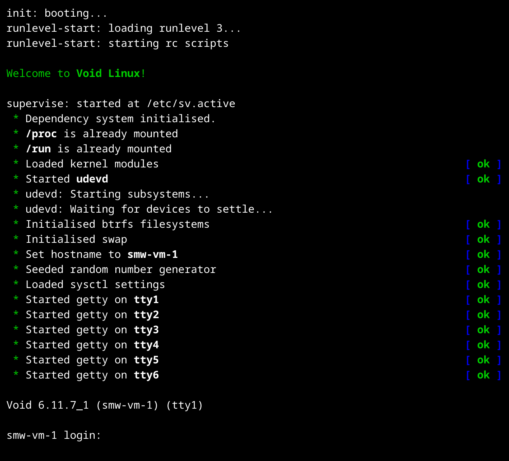

# opus

opus is two main things: an init system and a service management scheme. The
init system can function without the service management scheme and vice versa,
though they come in the same package.

**opus is currently in the pre-alpha stage and is not usable.** Not all of its
components have even been written yet, and it will need some time to mature and
for bugs (if any exist) to be squashed. I hope to release opus in the alpha
stage at some point in early 2025.

For stuff that needs doing, see the [TODO](TODO.md) list.

## Recent Change in Direction

We had a recent rebrand from 'ginitd' (since the Gershwin OS project is now
abandoned; ginitd was the **G**ershwin **init** **d**aemon) to 'opus'. This name
is somewhat obviously derived from the Latin word 'opus', but more in the sense
of a 'need' than in the sense of a '(piece of) work'. This is to align with the
new innovative focus of the service manager, an extensible dependency and target
based system.

### SCREENSHOT

This is a screenshot of an older version of opus:

